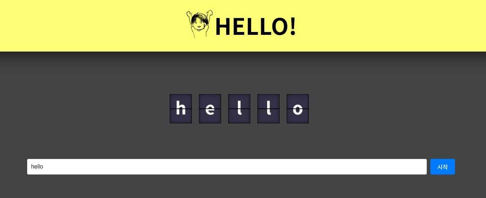

# Flipboard

Flipboard は伝統的なフリップボード（Flip Board）をウェブで実装したアプリケーションです。フリップボードは元々空港や駅で時刻表や案内文を表示するために使用されていた機械式の表示板で、アルファベットや数字が書かれたプラスチック板が電気モーターで回転しながら情報を表示する方式でした。

このプロジェクトは、そのような機械式フリップボードの独特な視覚効果とアニメーションをウェブで再現します。ユーザーが入力したテキストが実際のフリップボードのように各文字が回転しながら表示され、クラシックなフリップボードの魅力を現代的なウェブ環境で体験することができます。Angular 20 ベースで開発され、スムーズなアニメーションとレスポンシブデザインを提供します。

## デモ動画

[](sample.mp4)

※ デモ動画は [sample.mp4](sample.mp4) ファイルでご確認いただけます。

## 技術スタック

- Angular 20
- TypeScript
- RxJS
- Express (SSR 対応)

## 始め方

### 必要条件

- Node.js (最新の LTS バージョン推奨)
- npm または yarn

### インストール

```bash
# 依存関係のインストール
npm install
```

### 開発サーバーの起動

```bash
# 開発サーバー開始
npm start
```

ブラウザで `http://localhost:4200` にアクセスしてアプリケーションを確認できます。

### ビルド

```bash
# プロダクションビルド
npm run build
```

ビルドされたファイルは `dist/` ディレクトリに生成されます。

### SSR サーバーの起動

```bash
# SSRサーバー開始
npm run serve:ssr:flipboard
```

### テスト

```bash
# ユニットテストの実行
npm test
```

## デプロイ

```bash
# デプロイ
npm run deploy
```

## プロジェクト構造

```
flipboard/
├── src/              # ソースコード
├── public/           # 静的ファイル
├── docs/            # ドキュメント
├── dist/            # ビルド成果物
└── node_modules/    # 依存モジュール
```

## ライセンス

このプロジェクトは MIT ライセンスの下で提供されています。

---

# 플립보드

플립보드는 전통적인 플립보드(Flip Board)를 웹으로 구현한 애플리케이션입니다. 플립보드는 원래 공항이나 기차역에서 시간표나 안내문을 표시하는 데 사용되던 기계식 전시판으로, 알파벳이나 숫자가 적힌 플라스틱 판들이 전기 모터로 회전하며 정보를 보여주는 방식이었습니다.

이 프로젝트는 그런 기계식 플립보드의 독특한 시각적 효과와 애니메이션을 웹에서 재현합니다. 사용자가 입력한 텍스트가 실제 플립보드처럼 각 글자가 회전하며 표시되며, 클래식한 플립보드의 매력을 현대적인 웹 환경에서 경험할 수 있습니다. Angular 20 기반으로 개발되어 부드러운 애니메이션과 반응형 디자인을 제공합니다.

## 데모 영상

[](sample.mp4)

※ 데모 영상은 [sample.mp4](sample.mp4) 파일에서 확인하실 수 있습니다.

## 기술 스택

- Angular 20
- TypeScript
- RxJS
- Express (SSR 지원)

## 시작하기

### 필수 조건

- Node.js (최신 LTS 버전 권장)
- npm 또는 yarn

### 설치

```bash
# 의존성 설치
npm install
```

### 개발 서버 실행

```bash
# 개발 서버 시작
npm start
```

브라우저에서 `http://localhost:4200`으로 접속하여 애플리케이션을 확인할 수 있습니다.

### 빌드

```bash
# 프로덕션 빌드
npm run build
```

빌드된 파일은 `dist/` 디렉토리에 생성됩니다.

### SSR 서버 실행

```bash
# SSR 서버 시작
npm run serve:ssr:flipboard
```

### 테스트

```bash
# 단위 테스트 실행
npm test
```

## 배포

```bash
# 배포
npm run deploy
```

## 프로젝트 구조

```
flipboard/
├── src/              # 소스 코드
├── public/           # 정적 파일
├── docs/            # 문서
├── dist/            # 빌드 결과물
└── node_modules/    # 의존성 모듈
```

## 라이선스

이 프로젝트는 MIT 라이선스를 따릅니다.
